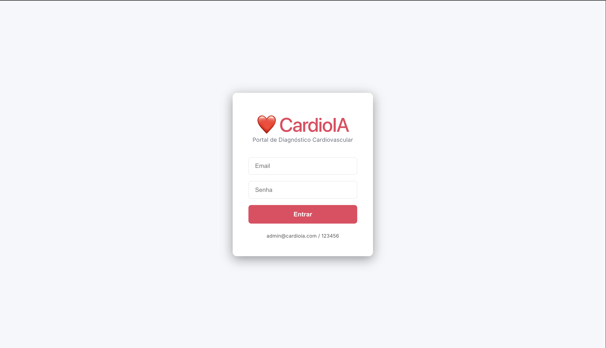
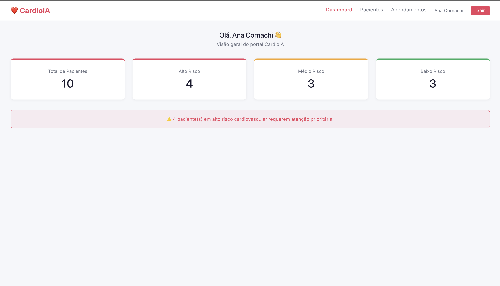
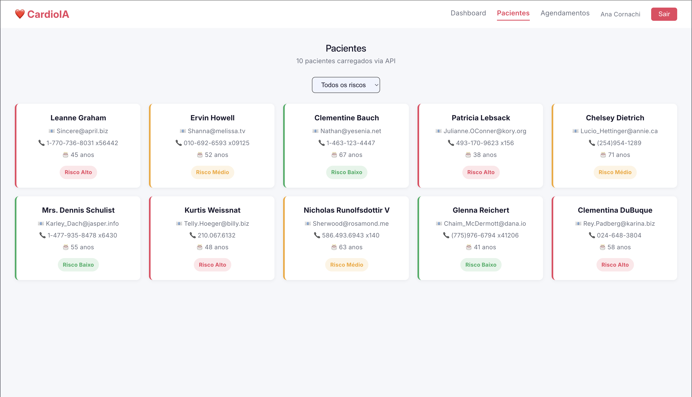
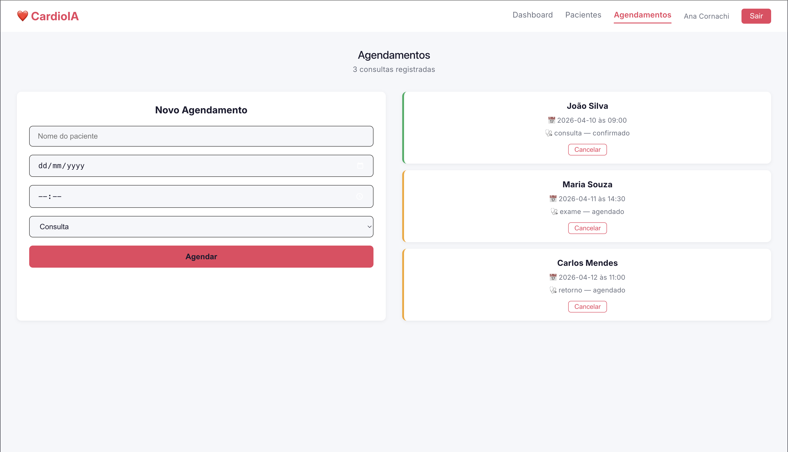

# CardioIA Portal

<p align="center">
  
  
  
  
</p>

## 👨‍🎓 Integrantes

- [Ana Cornachi](https://www.linkedin.com/in/anacornachi/)
- [Carla Máximo](https://www.linkedin.com/in/carlamaximo/)

## 👩‍🏫 Professores

- **Tutor:** Lucas Gomes Moreira
- **Coordenador:** André Godoi Chiovato

---

## 📋 Sobre o Projeto

Portal front-end do CardioIA, sistema de apoio ao diagnóstico cardiovascular.
A aplicação simula a rotina de um portal clínico com autenticação, listagem
de pacientes, agendamento de consultas e dashboard de métricas.

### Dados Simulados

Os dados de pacientes são obtidos via **JSONPlaceholder API** — uma API pública
de dados fake usada para prototipagem. A estrutura dos usuários vem da API,
mas nomes, telefones e idades são sobrescritos por dados brasileiros simulados
localmente, tornando a experiência mais próxima da realidade clínica nacional.
Nenhum dado real de paciente é utilizado na aplicação.

---

## 🖥️ Screenshots

### Login



### Dashboard



### Pacientes



### Agendamentos



## ✨ Funcionalidades

- **Autenticação simulada** via Context API com JWT fake no localStorage
- **Proteção de rotas** — páginas só acessíveis após login
- **Dashboard** com métricas de pacientes por nível de risco
- **Listagem de pacientes** consumida via JSONPlaceholder API com filtro por risco
- **Agendamento de consultas** com useReducer (adicionar e cancelar)
- **Navbar responsiva** com indicador de página ativa
- **Light mode** com design limpo e responsivo

---

## 🗂️ Estrutura do Projeto

```
src/
├── contexts/
│   ├── AuthContext.tsx      ← AuthProvider + contexto
│   └── useAuth.ts          ← hook de autenticação
├── components/
│   ├── PrivateRoute.tsx     ← proteção de rotas
│   ├── Navbar.tsx           ← navegação com página ativa
│   └── PatientCard.tsx      ← card de paciente com badge de risco
├── pages/
│   ├── Login.tsx            ← autenticação simulada
│   ├── Dashboard.tsx        ← métricas e alertas
│   ├── Patients.tsx         ← listagem com filtro
│   └── Appointments.tsx     ← formulário + lista de agendamentos
├── services/
│   └── api.ts              ← integração JSONPlaceholder
├── reducers/
│   └── appointmentReducer.ts ← useReducer para agendamentos
├── styles/
│   └── global.ts           ← estilos globais
└── types/
└── index.ts            ← interfaces TypeScript
```

---

## 🔧 Instalação e Execução

### Pré-requisitos

- Node.js 18+
- npm 9+

### Passos

```bash
# Clone o repositório
git clone https://github.com/seu-usuario/cardioia-portal.git
cd cardioia-portal

# Instale as dependências
npm install

# Inicie o servidor de desenvolvimento
npm run dev
```

Acesse `http://localhost:5173` no browser.

### Credenciais de acesso

| Email               | Senha  |
| ------------------- | ------ |
| admin@cardioia.com  | 123456 |
| medico@cardioia.com | 123456 |

---

## 🛠️ Tecnologias

- **React 18** + **Vite** + **TypeScript**
- **Styled Components v6** — estilização com CSS-in-JS
- **React Router DOM v7** — navegação e proteção de rotas
- **Context API** — gerenciamento de autenticação global
- **useReducer** — controle de estado dos agendamentos
- **JSONPlaceholder** — API pública para simulação de dados

---

## 🎥 Vídeo de Demonstração

---

## 🗃️ Histórico de Lançamentos

- **1.0.0** - 09/04/2026
  - Entrega completa do portal CardioIA com autenticação, dashboard,
    listagem de pacientes, agendamentos e design responsivo em light mode.

---

## 📋 Licença


MODELO GIT FIAP por Fiap está licenciado sobre Attribution 4.0 International.
